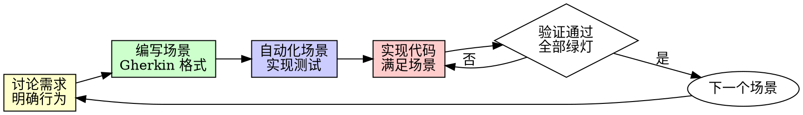

# 行为驱动开发（BDD）

## 概述

先写行为场景。让团队理解需求。用测试验证行为。

**核心原则：** BDD 是关于"做什么"的对话，不只是测试格式。Gherkin 场景是需求文档，也是可执行的测试。

## 何时使用

**应该使用：**
- 新功能开发（先定义行为再编码）
- 与非技术人员协作（业务人员可读的场景）
- 需求不清晰时（用场景澄清理解）
- 需要活文档时（场景即文档，永不过期）

**与 TDD 的区别：**
- TDD：从开发者视角写单元测试
- BDD：从用户视角写行为场景

**可与 TDD 结合：**
- BDD 定义外部行为（用户能看到什么）
- TDD 验证内部实现（代码如何工作）

## 铁律

```
场景描述行为，而非实现细节
```

场景应该描述"用户期望发生什么"，而非"系统如何实现它"。

**好的场景特征：**
- 业务人员能读懂
- 不涉及技术术语（API、数据库、类名）
- 描述一个完整的用户交互
- 可自动化验证

## Gherkin 基础

Gherkin 是 BDD 的场景语言，使用三个关键字：

```gherkin
Feature: 用户登录
  作为一名访客
  我想要登录系统
  以便访问我的个人内容

  Scenario: 使用正确的凭证登录成功
    Given 我在登录页面
    And 我有一个已注册的账户 "alice@example.com"
    When 我输入邮箱 "alice@example.com"
    And 我输入密码 "correct-password"
    And 我点击"登录"按钮
    Then 我应该看到"欢迎回来"消息
    And 我应该被导航到首页

  Scenario: 使用错误密码登录失败
    Given 我在登录页面
    And 我有一个已注册的账户 "alice@example.com"
    When 我输入邮箱 "alice@example.com"
    And 我输入密码 "wrong-password"
    And 我点击"登录"按钮
    Then 我应该看到"密码错误"消息
    And 我应该仍在登录页面
```

### 关键字说明

| 关键字 | 作用 | 示例 |
|--------|------|------|
| **Feature** | 功能名称和背景 | `Feature: 用户登录` |
| **Scenario** | 单个行为场景 | `Scenario: 登录成功` |
| **Given** | 前置条件（初始状态） | `Given 我在登录页面` |
| **When** | 用户动作 | `When 我点击"登录"` |
| **Then** | 期望结果 | `Then 我应该看到欢迎消息` |
| **And/But** | 连接多个步骤 | `And 我输入邮箱` |

### 背景（Background）

多个场景共享的前置条件：

```gherkin
Feature: 购物车管理

  Background:
    Given 商店有以下商品
      | 名称     | 价格 |
      | 苹果     | 5元  |
      | 香蕉     | 3元  |

  Scenario: 添加商品到购物车
    Given 我在商品列表页面
    When 我点击"苹果"的"添加到购物车"
    Then 我的购物车应该有 1 个商品
    And 购物车总价应该是 5元
```

### 数据表

在步骤中传递结构化数据：

```gherkin
Given 商店有以下商品
  | 名称 | 价格 | 库存 |
  | 苹果 | 5元  | 100  |
  | 香蕉 | 3元  | 50   |

When 我批量添加商品
  | 名称 | 数量 |
  | 苹果 | 2    |
  | 香蕉 | 3    |

Then 购物车内容应该是
  | 名称 | 数量 | 小计 |
  | 苹果 | 2    | 10元 |
  | 香蕉 | 3    | 9元  |
```

### 场景大纲（Scenario Outline）

用变量模板化相似场景：

```gherkin
Scenario Outline: 登录验证
  Given 我在登录页面
  And 我有一个账户 "<email>"
  When 我输入邮箱 "<email>"
  And 我输入密码 "<password>"
  Then 登录结果应该是 "<result>"

  Examples:
    | email              | password      | result    |
    | alice@example.com  | correct-pass  | 成功      |
    | alice@example.com  | wrong-pass    | 失败      |
    | unknown@test.com   | any-pass      | 失败      |
    | alice@example.com  |               | 失败      |
```

## BDD 工作流程



### 1. 讨论 - 明确行为

在写任何代码之前，先讨论：

- **用户是谁？**（作为...）
- **用户想要什么？**（我想要...）
- **为什么需要？**（以便...）

<Good>
```
Feature: 订单取消
  作为一名买家
  我想要取消未发货的订单
  以便在不需要时拿回退款
```
角色、目标、理由清晰
</Good>

<Bad>
```
Feature: 订单管理
  系统支持订单状态变更
  包括取消操作
```
没有用户视角，模糊不清
</Bad>

### 2. 编写 - Gherkin 场景

把讨论结果写成可执行的场景：

<Good>
```gherkin
Scenario: 取消未发货订单
  Given 我有一个订单 "ORD-123"
  And 订单状态是 "待发货"
  When 我取消订单 "ORD-123"
  Then 订单状态应该变为 "已取消"
  And 我应该收到全额退款
```
具体、可验证、不涉及实现
</Good>

<Bad>
```gherkin
Scenario: 取消订单
  Given 数据库有订单记录
  When 调用 cancelOrder API
  Then 返回 success
  And 更新订单表
```
技术术语，业务人员看不懂
</Bad>

### 3. 自动化 - 实现测试

把场景转化为可执行的测试：

```typescript
// Cypress 示例
describe('订单取消', () => {
  it('取消未发货订单', () => {
    cy.visit('/orders/ORD-123');
    cy.get('[data-testid=status]').should('contain', '待发货');
    cy.get('[data-testid=cancel-btn]').click();
    cy.get('[data-testid=status]').should('contain', '已取消');
    cy.get('[data-testid=refund-amount]').should('contain', '¥299');
  });
});
```

或使用 Cucumber/Playwright 等专用 BDD 工具。

### 4. 实现 - 写生产代码

按场景行为实现：

- 实现刚好让场景通过的功能
- 不要添加场景未描述的行为
- 使用 TDD 验证内部逻辑

### 5. 验证 - 确保绿灯

运行所有场景：

```bash
npm run bdd    # 或 cucumber、playwright test
```

确认：
- 新场景通过
- 旧场景没有回归
- 行为符合业务预期

## 常见问题与解决方案

| 问题 | 解决方案 |
|------|----------|
| 场景太长 | 拆分多个场景，每个聚焦一个行为 |
| 步骤太技术化 | 用用户视角重写：点击按钮而非调用 API |
| 场景难以自动化 | 简化或用 Given 设置更可控的前置条件 |
| 业务人员不参与 | BDD 的价值在于协作，邀请他们参与讨论 |
| 与单元测试重复 | BDD 测试外部行为，单元测试测内部实现，各有价值 |

## 场景命名规范

| 规范 | 好的示例 | 差的示例 |
|------|----------|----------|
| 描述行为 | `登录成功` | `test_login_01` |
| 包含结果 | `取消订单后收到退款` | `取消订单` |
| 唯一明确 | `使用微信支付下单` | `支付` |

## 三 amigo 会议

BDD 推荐的三方协作：

- **产品/业务**：定义"做什么"（需求正确性）
- **开发**：定义"怎么做"（技术可行性）
- **测试**：定义"怎么验证"（场景完整性）

会议产出：Feature 文件 + 澄清的边界条件

## 与 TDD 结合

BDD 和 TDD 可以协同：

```gherkin
# BDD 场景（外部行为）
Scenario: 用户搜索商品
  Given 商店有商品 "苹果"
  When 我搜索 "苹果"
  Then 我应该看到商品 "苹果"
```

```typescript
// TDD 单元测试（内部实现）
test('searchProducts 返回匹配商品', () => {
  const catalog = [{ name: '苹果' }, { name: '香蕉' }];
  const result = searchProducts(catalog, '苹果');
  expect(result).toEqual([{ name: '苹果' }]);
});
```

- BDD：验证用户能看到搜索结果
- TDD：验证搜索算法正确匹配

## 危险信号

- 场景描述数据库操作而非用户行为
- 业务人员说"看不懂这个场景"
- 场景有 10+ 个步骤
- Given 步骤设置复杂的技术状态
- 场景名称是"测试 X"
- 没有 Feature 描述用户角色和目标
- 只由开发人员编写场景（缺少协作）

**以上信号出现时，停下来重新讨论需求。**

## 参考资源

更多 Gherkin 语法和BDD最佳实践，见：
- `references/gherkin-guide.md` — Gherkin 完整语法参考
- `references/bdd-best-practices.md` — BDD 最佳实践

## 验证清单

在标记工作完成之前：

- [ ] Feature 有角色、目标、理由描述
- [ ] 每个场景描述单一用户行为
- [ ] 步骤使用用户视角而非技术术语
- [ ] 场景可自动化验证
- [ ] 所有场景通过（绿灯）
- [ ] 业务人员确认场景描述正确需求
- [ ] 实现不超出场景描述的范围

## 最终规则

```
场景是需求文档 → 业务可读、开发可实现、测试可验证
否则 → 不是真正的 BDD
```

没有你的人类伙伴的许可，没有例外。