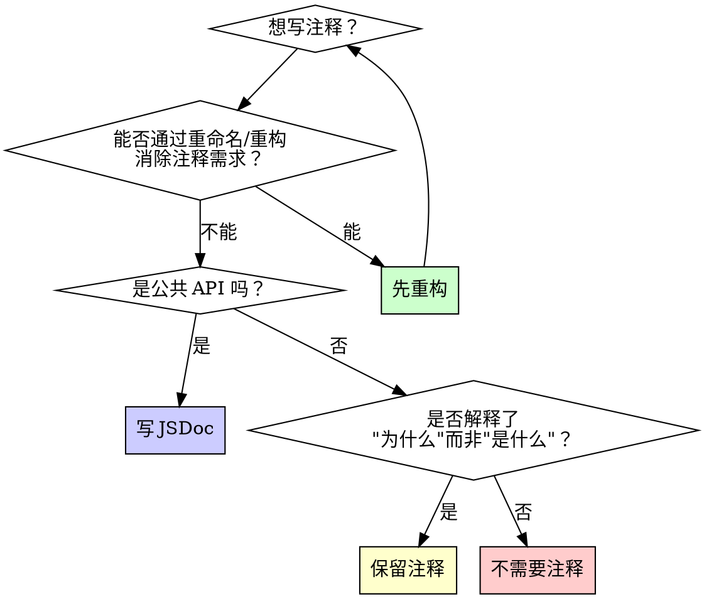

# 代码注释指南

## 概述

**核心原则：公共 API 写 JSDoc，其余不写冗余注释。**

注释是最后的手段。优先通过重构和自解释命名消除对注释的需要。

适用所有语言，特别针对 TypeScript/JavaScript 优化。

## 何时使用

**应该使用：**
- 代码审查时评估注释质量
- 编写新代码时判断是否需要注释
- 重构时清理过时注释
- 生成公共文档时编写 JSDoc
- 代码质量检查时检测注释问题

## 铁律

```
1. 不删除原有注释——除非注释与本次代码改动直接冲突、且必须同步修正
2. 修改代码时，必须同步检查注释是否仍然为真
3. 过期注释必须同步修正，不能放着误导后人
4. 新增注释默认中文；TODO/FIXME/NOTE 标签保留英文关键字，正文用中文
5. 临时注释必须带触发条件或保留原因，避免无期限悬空
```

## 决策框架

在写注释之前，按此顺序判断：



### 1. 先重构清单

在写任何注释之前，问自己：

| 问题 | 如果能，则 |
|------|-----------|
| 能否通过更好的命名消除注释？ | 重命名变量/函数 |
| 能否通过提取函数消除注释？ | 提取为独立函数 |
| 能否通过简化逻辑消除注释？ | 简化实现 |
| 能否通过使用更清晰的类型消除注释？ | 用类型表达意图 |

<Good>
```typescript
// 重构前——需要注释解释
// Check if user is eligible for discount
function check(u: User) { ... }

// 重构后——代码自解释
function isEligibleForDiscount(user: User): boolean { ... }
```
命名直接表达意图，无需注释
</Good>

**注意：** 先重构清单只适用于你**正在写的新注释**。已有注释不要主动删除——除非与你本次改动直接冲突。

### 2. 公共 API 的 JSDoc

公共 API（导出的函数、类、接口）必须写 JSDoc：

<Good>
```typescript
/**
 * 计算订单折扣金额
 *
 * @param order - 订单对象，需包含商品列表和总价
 * @param discountRate - 折扣率，0-1 之间
 * @returns 折扣后的价格，最低为 0
 *
 * @throws {Error} 当 discountRate 不在 0-1 范围时抛出
 *
 * @example
 * applyDiscount({ items: [...], total: 100 }, 0.2) // 80
 */
export function applyDiscount(order: Order, discountRate: number): number {
  if (discountRate < 0 || discountRate > 1) {
    throw new Error('discountRate must be between 0 and 1');
  }
  return Math.max(0, order.total * (1 - discountRate));
}
```
公共 API：描述用途、参数、返回值、异常、示例
</Good>

<Bad>
```typescript
// apply discount to order
export function applyDiscount(o: Order, d: number): number {
  return Math.max(0, o.total * (1 - d));
}
```
公共 API 没有文档，参数名无意义，缺少边界检查说明
</Bad>

### 3. 内部代码的注释

内部（非导出）代码只在不明显的原因处写注释：

<Good>
```typescript
// 后端 API 返回的时间戳是秒级，Date 构造函数需要毫秒
const createdAt = new Date(apiResponse.timestamp * 1000);
```
解释了"为什么"——API 和 Date 的单位不一致
</Good>

<Bad>
```typescript
// 将时间戳转为 Date 对象
const createdAt = new Date(apiResponse.timestamp * 1000);
```
代码已经说明了"是什么"，注释是冗余的
</Bad>

## 什么时候必须写注释

遇到以下场景，**必须**写注释——哪怕你觉得"这段代码很清楚"：

| 场景 | 为什么必须注释 | 示例 |
|------|---------------|------|
| **非直观的业务约束** | 后来者不知道这个限制 | `// 退款超过 7 天不允许申请，财务合规要求` |
| **协议/接口约束** | 外部系统说改就改，内部得留线索 | `// 微信回调要求 5 秒内返回 "SUCCESS"，否则重试 3 次` |
| **兼容性分支** | 看起来多余的代码有存在的理由 | `// 兼容 v1 客户端：旧版不传 format 字段，默认走 JSON` |
| **历史包袱** | 不解释会被"优化"掉 | `// 这段排序不能改——下游 BI 报表依赖此顺序，改了数据对不上` |
| **外部系统耦合** | 耦合点不在本仓库里 | `// 第三方支付回调的签名算法与文档不一致，已确认是他们的 bug` |
| **容易误改的边界条件** | 看起来能改，实际上不能 | `// offset 从 1 开始——不是 0——因为对端 ERP 系统的约定` |
| **状态机切换条件** | 转换条件不明显 | `// 只有 paid → shipped 允许，跳过 paid 直接 shipped 会被风控拦截` |
| **持久化/流式/并发前提** | 多线程/异步场景下的隐含假设 | `// 此处依赖 channel 已经建立，不能在 connect() 之前调用` |
| **unsafe / 绕过类型系统** | 安全边界，必须标注原因 | `// SAFETY: 这个指针在函数返回前不会被释放，调用者负责 free` |
| **手工资源管理** | 不注释就是定时炸弹 | `// fd 在此处关闭，之后不能再 read——loop 已经 unregister` |
| **跨线程/跨进程桥接** | 并发安全的前提条件 | `// 此字段只被主线程写入，worker 线程只读——无需加锁` |
| **公共 API / 导出类型** | 别人会依赖，必须文档化 | JSDoc / doc comment |
| **临时 workaround** | 不标注就没人知道是临时的 | `// WORKAROUND: 上游服务返回 500 时重试，等他们修了删掉这段` |
| **保留旧行为的防线** | 表面上不明显的保护逻辑 | `// 故意不过滤 null——旧版客户端依赖空值做占位，删了会白屏` |

## 注释应该写什么

注释回答三个问题，而不是翻译代码：

| 问题 | 写什么 | 不写什么 |
|------|--------|----------|
| **为什么存在** | 业务原因、历史背景、外部约束 | 代码做的事 |
| **依赖什么前提** | 调用顺序、数据格式、外部状态 | 函数签名里的类型 |
| **不能随便改哪里** | 耦合点、兼容性要求、性能约束 | 重构建议 |

<Good>
```rust
// 退款金额用 i32 而非 f64——财务对账要求精确到分
// 不能改成浮点，否则累计误差会导致日终结账不平
fn calculate_refund(amount_cents: i32, rate: i32) -> i32 {
```
写了"为什么存在"（财务要求）、"不能随便改"（不能用浮点）
</Good>

<Bad>
```rust
// 计算退款金额，将 amount 乘以 rate
fn calculate_refund(amount_cents: i32, rate: i32) -> i32 {
```
重复代码做的事，后来者读完还是不知道为什么用整数
</Bad>

## 注释类型与规则

### 必须写的注释

| 类型 | 说明 | 示例 |
|------|------|------|
| **公共 API JSDoc** | 导出函数/类/接口 | 用途、参数、返回值、异常 |
| **非显而易见的 Why** | 解释"为什么"而非"是什么" | 特殊的业务逻辑、规避特定 bug |
| **TODO/FIXME** | 标记待办或已知问题 | `// TODO: 处理超时重试` |
| **性能关键注释** | 解释看似低效的代码为何如此 | `// 故意不用 Set：热点路径，避免 GC 压力` |

### 不该写的注释（新写代码时避免）

| 类型 | 为什么 | 处理 |
|------|--------|------|
| **重复代码的注释** | 注释说的是代码做的事 | 不写 |
| **变更日志注释** | git 有完整历史 | 不写 |
| **注释掉的代码** | 版本控制已记录 | 不留 |
| **分隔线注释** | 模块化不够 | 拆分为独立文件/函数 |
| **误导性注释** | 比没注释更危险 | 修正或删除 |

<Bad>
```typescript
// ==================== User Functions ====================

// Function to get user by ID
function getUserById(id: string) {
  // fetch user from database
  const user = db.users.findById(id);
  // return the user
  return user;
}

// 2024-01-15: added error handling (John)
// 2024-02-03: changed to use findById (Jane)
// 2024-03-20: optimized query (Bob)
```
冗余注释、变更日志、分隔线、注释掉的代码——全是噪音
</Bad>

<Good>
```typescript
function getUserById(id: string): Promise<User> {
  return db.users.findById(id);
}
```
命名清晰，无需注释
</Good>

### 对已有注释的态度

**不动。** 已有注释除非与本次代码改动直接冲突、且必须同步修正，否则不做任何改动。其他人的注释可能保护着你看不到的约束。

## 中文注释规范

| 规范 | 好的 | 差的 |
|------|------|------|
| 默认中文 | `// 退款超过 7 天不允许，财务合规要求` | `// refund not allowed after 7 days` |
| 标签保留英文 | `// TODO: 等微信 API v3 上线后迁移` | `// 待办: 等微信 API v3 上线后迁移` |
| 技术术语保留英文 | `// Zod schema 验证放在 parse 之前` | `// 模式验证放在解析之前` |

**判断标准：** 新同事能一遍读懂，不用猜技术术语对应什么。

## 临时注释规范

所有临时注释必须带触发条件或保留原因，不允许无期限悬空：

<Good>
```
// TODO: 迁移到新 API 后删除——预计 2025 Q3 上线 v3 接口
// WORKAROUND: 上游服务偶发 500，等他们修了删掉（已提工单 INFRA-2847）
// HACK: iOS 15 Safari 不支持 structuredClone，等最低版本升到 16 后去掉
// NOTE: 此处故意 sleep 200ms，否则上游限流会拒绝连续请求
```
每个临时注释都有删除条件或保留原因
</Good>

<Bad>
```
// TODO: fix this later
// 临时方案
// hack
// 先这样写
```
没有触发条件，不知道什么时候能删
</Bad>

## 重构示例

### 示例 1：用函数名替代注释

<Bad>
```typescript
// Check if the user has admin privileges
if (user.role === 'admin' && user.isActive && !user.isSuspended) {
  // ...
}
```
</Bad>

<Good>
```typescript
if (isActiveAdmin(user)) {
  // ...
}
```
</Good>

### 示例 2：用变量名替代注释

<Bad>
```typescript
// 86400000 milliseconds in a day
const duration = end - start;
if (duration > 86400000) { ... }
```
</Bad>

<Good>
```typescript
const MS_PER_DAY = 86_400_000;
const durationMs = end - start;
if (durationMs > MS_PER_DAY) { ... }
```
</Good>

### 示例 3：用类型替代注释

<Bad>
```typescript
// status can be 'active', 'inactive', or 'suspended'
function updateStatus(id: string, status: string) { ... }
```
</Bad>

<Good>
```typescript
type UserStatus = 'active' | 'inactive' | 'suspended';

function updateStatus(id: string, status: UserStatus) { ... }
```
</Good>

### 示例 4：解释非显而易见的 Why

<Good>
```typescript
// Zod 验证放在 catch 之前，因为第三方 API 可能返回不符合契约的数据
// 之前直接访问字段导致生产环境 TypeError（详见 #2847）
try {
  const payload = apiResponseSchema.parse(raw);
} catch {
  return { error: 'invalid_response' };
}
```
解释了为什么需要验证（历史 bug）以及验证的原因（第三方 API 不可信）
</Good>

## 检测过时注释

过时注释比没有注释更危险——它会误导读者。

**过时注释的信号：**
- 注释描述的行为与代码实际行为不一致
- 注释引用了已删除的函数/变量
- 注释中的 TODO 时间超过 3 个月
- 注释说"临时方案"但没有后续计划
- 代码修改后注释没有同步更新

**处理方式：** 发现过时注释时，立即修正。改了代码必须同步检查注释——不能放着误导后人。

## 参考资源

更多 JSDoc 模板和注释检测工具，见：
- `references/jsdoc-templates.md` — 各场景 JSDoc 模板（函数、类、React、Hook、类型）
- `references/comment-smells.md` — 注释异味检测清单与审查流程

## 验证清单

在标记代码完成之前：

- [ ] 每个导出函数/类都有 JSDoc（用途、参数、返回值）
- [ ] 没有重复代码行为的冗余注释
- [ ] 没有注释掉的代码
- [ ] 没有变更日志式注释（用 git 历史代替）
- [ ] 内部注释只解释"为什么"，不解释"是什么"
- [ ] 没有误导性或过时的注释
- [ ] TODO/FIXME 标注了具体内容（不是空的"TODO: fix"）
- [ ] 本次改动的代码附近，注释仍然为真
- [ ] 过期注释已同步修正（不是删除，是修正）
- [ ] 临时注释带有触发条件或删除条件
- [ ] 新增注释是中文（标签可保留英文）
- [ ] 注释解释了"为什么存在"和"不能随便改什么"
- [ ] `unsafe` / 绕过类型系统的地方有 `// SAFETY` 说明

## 最终规则

```
注释解释"为什么"，代码解释"是什么"
能重构消除的注释 → 重构
公共 API → JSDoc
其余 → 不写
改代码必须同步检查注释——过期注释立即修正
已有注释不主动删除——除非与本次改动直接冲突
新增注释默认中文——标签保留英文
临时注释必须带删除条件——不允许无期限悬空
```

没有你的人类伙伴的许可，没有例外。