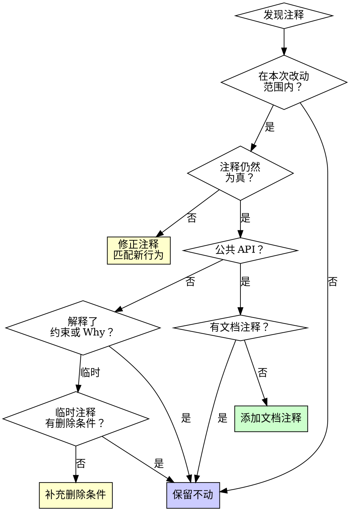

# 注释异味检测指南

**加载时机：** 代码审查时，用于系统化检测注释问题。

## 核心态度

**不主动删除已有注释。** 只处理与本次改动直接冲突或明确误导的注释。

## 检测清单

按以下顺序扫描本次改动涉及的注释：

### 1. 本次改动导致的过期注释（必须修正）

| 异味 | 检测方法 | 处理 |
|------|----------|------|
| **行为不一致** | 注释描述 ≠ 改动后代码的实际行为 | 修正注释以匹配新行为 |
| **参数遗漏** | JSDoc 缺少新增的参数 | 补全 |
| **返回值错误** | @returns 与改动后的返回值不符 | 修正 |
| **异常遗漏** | 缺少新引入的异常 | 补全 |
| **引用失效** | 注释引用的函数/变量已被本次改动改名或删除 | 同步更新 |

### 2. 新写代码应避免的注释（自我审查）

| 异味 | 示例 | 正确做法 |
|------|------|----------|
| **重复代码行为** | `// 设置 name` → `name = value` | 不写，靠命名 |
| **变更日志** | `// 2024-03-15: added error handling` | 不写，用 git |
| **注释掉的代码** | `// const old = compute()` | 不留，用 git |
| **分隔线** | `// ====== User ======` | 不写，拆文件 |
| **无期限临时注释** | `// TODO: fix later` | 必须带删除条件 |

### 3. 本次改动应补全的注释（必须添加）

| 场景 | 检查 |
|------|------|
| 新增导出函数/类 | 是否有文档注释 |
| 新增 `unsafe` 块 | 是否有 `// SAFETY` 说明 |
| 新增 workaround | 是否有删除条件 |
| 新增边界条件 | 是否标注了前提假设 |
| 新增跨系统耦合 | 是否标注了依赖的外部约束 |

### 4. 已有注释（默认不动）

**只在以下情况修改已有注释：**
- 本次代码改动导致注释描述不再为真
- 注释引用的函数/变量被本次改动改名
- 临时注释的触发条件已满足（该删了）

**不主动修改的其他注释——即使你觉得冗余。** 你看不到的约束可能正靠它保护。

## 决策树



## 审查报告模板

```markdown
## 注释审查报告

### 本次改动导致的过期注释——需修正（M 处）

| 文件 | 行号 | 问题 | 原注释 | 修正建议 |
|------|------|------|--------|----------|
| api/auth.ts | 56 | @returns 不符 | `@returns User` | 改为 `@returns UserProfile` |
| lib/parser.ts | 203 | 缺少新异常 | 无 | 添加 `@throws {ParseError}` |

### 新代码应补充的注释（K 处）

| 文件 | 行号 | 函数/块 | 缺少什么 |
|------|------|---------|----------|
| utils/format.ts | export | formatDate | 缺少文档注释 |
| api/client.ts | 89 | unsafe 块 | 缺少 SAFETY 说明 |

### 已有注释——保留不动（P 处）

| 文件 | 行号 | 原注释 | 保留原因 |
|------|------|--------|----------|
| api/client.ts | 120 | `// API 返回秒级时间戳` | 描述外部约束，仍为真 |
| legacy/adapter.ts | 45 | `// 兼容 v1 客户端` | 保护兼容性代码 |

### 本次新增注释质量

| 文件 | 行号 | 新增注释 | 解释 Why | 中文 |
|------|------|----------|:---:|:---:|
| ... | ... | ... | ✅/❌ | ✅/❌ |
```

## 快速审查流程

1. **圈定范围** — 只看本次改动涉及的文件和函数
2. **检查同步** — 改了代码的地方，注释是否仍为真 → 修正
3. **检查新代码** — 新增的导出函数/unsafe/workaround 有注释 → 补全
4. **检查新增注释** — 写的是 Why 不是 What → 建议
5. **检查临时注释** — 带了删除条件 → 要求补全
6. **已有注释** — 不在改动范围内的 → 不动

## 统计指标

| 指标 | 计算 | 健康值 |
|------|------|--------|
| **同步率** | 改动后仍为真的注释 / 改动范围内的注释 | 100% |
| **覆盖率** | 有文档的导出函数 / 总导出函数 | > 90% |
| **条件率** | 带删除条件的临时注释 / 总临时注释 | 100% |
| **中文率** | 新增中文注释 / 总新增注释 | > 90% |

同步率和条件率必须 100%——否则不通过审查。