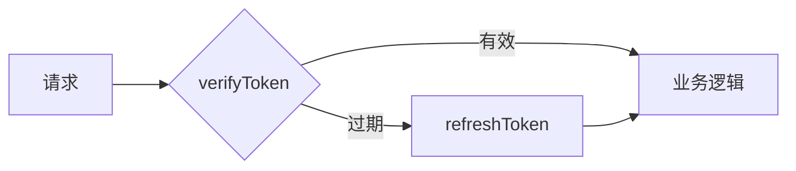
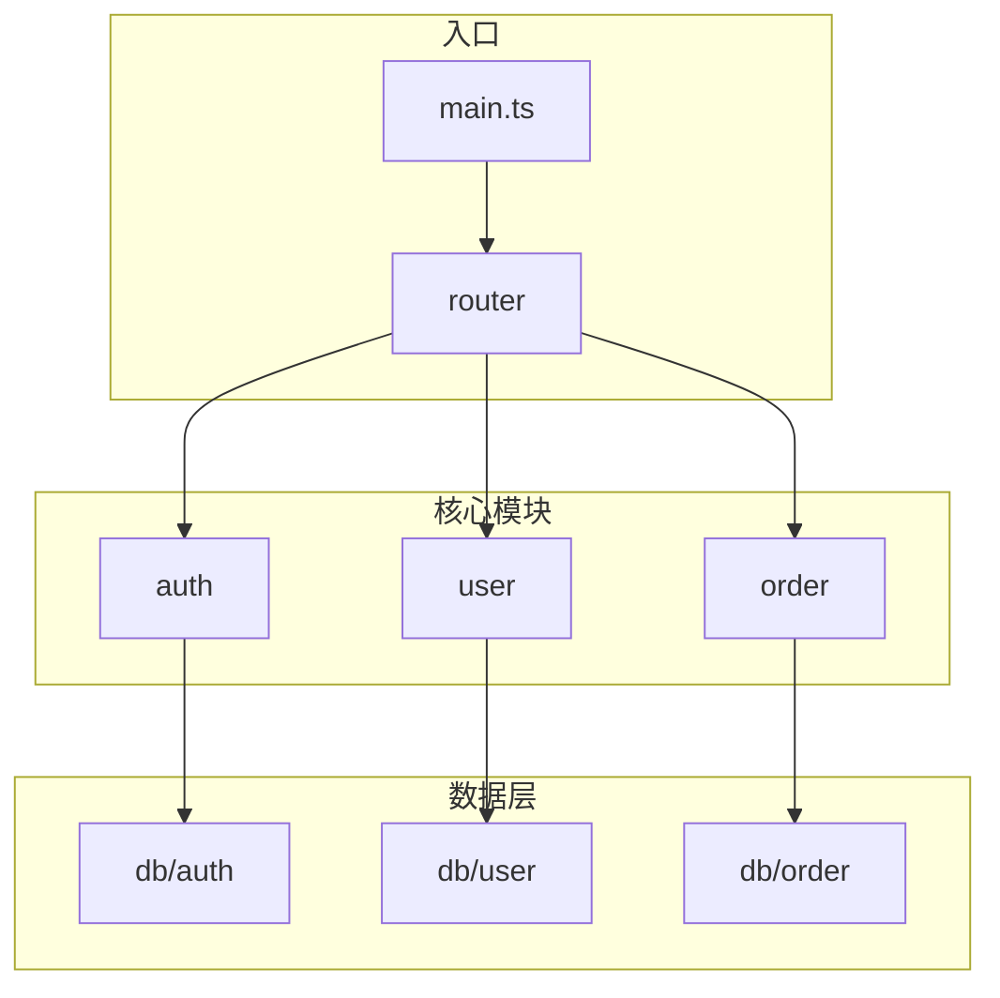
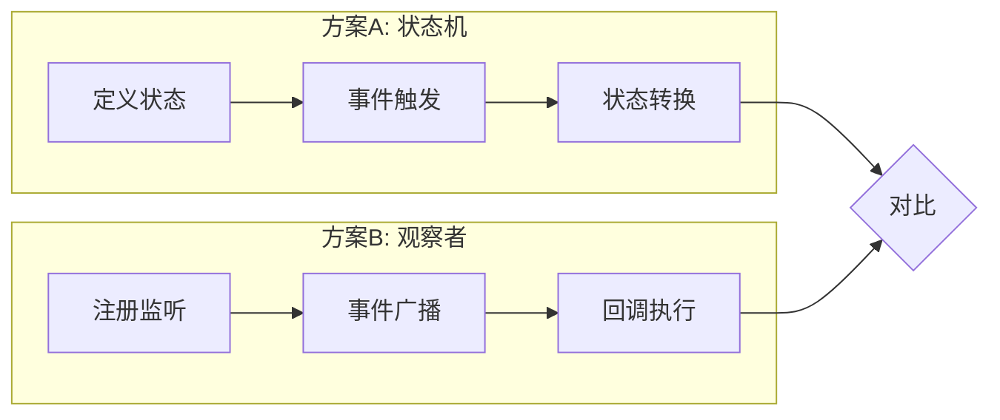

# explore 参考模板

本文件提供 `code-explore` 使用的 frontmatter、正文结构和写作说明。

## 1. frontmatter

```yaml
---
type: question | module-overview | spike
date: YYYY-MM-DD
status: active | outdated
confidence: high | medium | low
related: []
---
```

文件名：`docs/superpowers/explore/YYYY-MM-DD-{中文标题}.md`。

## 2. 正文结构

```markdown
## 速答

<!-- 结论前置——读者打开先看到结论 -->

{2-5 句话的核心结论。module-overview / spike 类型附 Mermaid 图。}

## 关键证据

| # | 结论 | 证据 | 位置 |
|---|------|------|------|
| 1 | {这条证据支撑什么结论} | {代码/配置的实际内容} | `file:line` |

## 探索范围

- 聚焦目录：{路径}
- 涉及文件：{列出关键文件}
- 跳过：{未覆盖的部分和原因}

## 置信度说明

<!-- confidence 为 medium/low 时必须解释原因 -->

## 后续建议

<!-- 一句话提示用户接下来可能的方向 -->
```

## 3. 各节写法说明

### 速答（最重要）

- **结论前置**——读者打开文档先看到结论，再决定要不要往下看证据
- 2-5 句话概括核心发现
- `module-overview` / `spike` 类型必须附 Mermaid 架构图
- 可操作——告诉读者"入口在哪"、"核心流程是什么"

示例：
```markdown
## 速答

用户认证模块入口在 `src/auth/index.ts:15`，核心流程：

1. `login()` 接收凭证 → 验证 → 生成 token
2. `verifyToken()` 每次请求校验 token 有效性
3. `refreshToken()` token 过期前自动续期


```

### 关键证据

- 目标 3-8 条，每条必须标注 `file:line`
- 每条证据说明"支撑哪个结论"
- 不支撑任何结论的证据不记录

示例：
```markdown
## 关键证据

| # | 结论 | 证据 | 位置 |
|---|------|------|------|
| 1 | 入口函数是 `login()` | `export function login(credentials)` | `src/auth/index.ts:15` |
| 2 | token 有效期 24h | `const TOKEN_EXPIRY = 24 * 60 * 60` | `src/auth/constants.ts:8` |
| 3 | refresh 在过期前 1h 触发 | `if (expiresIn < 3600) await refreshToken()` | `src/auth/verify.ts:42` |
```

### 探索范围

- 写清楚看了哪些目录/文件
- 写清楚没看什么（让读者知道边界）

示例：
```markdown
## 探索范围

- 聚焦目录：`src/auth/`
- 涉及文件：`index.ts`、`verify.ts`、`constants.ts`、`types.ts`
- 跳过：`src/auth/__tests__/`（测试文件）、`src/auth/legacy/`（已弃用）
```

### 置信度说明

- confidence 为 medium/low 时必须解释原因
- 说明哪些部分没覆盖、为什么不确定

示例：
```markdown
## 置信度说明

**confidence: medium**

- 只看了入口和核心函数，未深入错误处理分支
- `legacy/` 目录未覆盖，可能存在旧版逻辑
- 需要看测试文件确认边界条件处理
```

### 后续建议

- 一句话提示用户接下来可能的方向
- 下一步由用户自己决定，不枚举候选技能

示例：
```markdown
## 后续建议

已明确认证模块结构，可以基于此设计"添加 OAuth 登录"的方案。
```

## 4. 搜索已有文档

探索前先检查是否已有相似文档：

```bash
# 搜索包含关键词的探索文档
grep -r "关键词" docs/superpowers/explore/

# 搜索特定类型
grep -l "type: module-overview" docs/superpowers/explore/*.md

# 搜索活跃状态（排除过期的）
grep -L "status: outdated" docs/superpowers/explore/*.md
```

命中相近旧文档时：
- 先读它，能直接回答就告诉用户"已有一份在 {路径}"
- 旧文档可能过期：代码已变时在旧文档顶部标注 `> ⚠️ 此文档可能已过期`，新建一份替代

## 5. Mermaid 图示例

### module-overview 类型



### spike 类型（多方向对比）



## 6. 反模式对照

| 反模式 | 正确做法 |
|--------|----------|
| 结论写在证据后面 | 速答节必须在前 |
| 证据无 `file:line` | 每条证据标具体位置 |
| 证据条数过多 | 精简到 3-8 条，删掉不支撑结论的 |
| 无 Mermaid 图（module-overview/spike） | 速答节附架构图 |
| confidence 与证据不匹配 | 证据少就降为 medium/low |